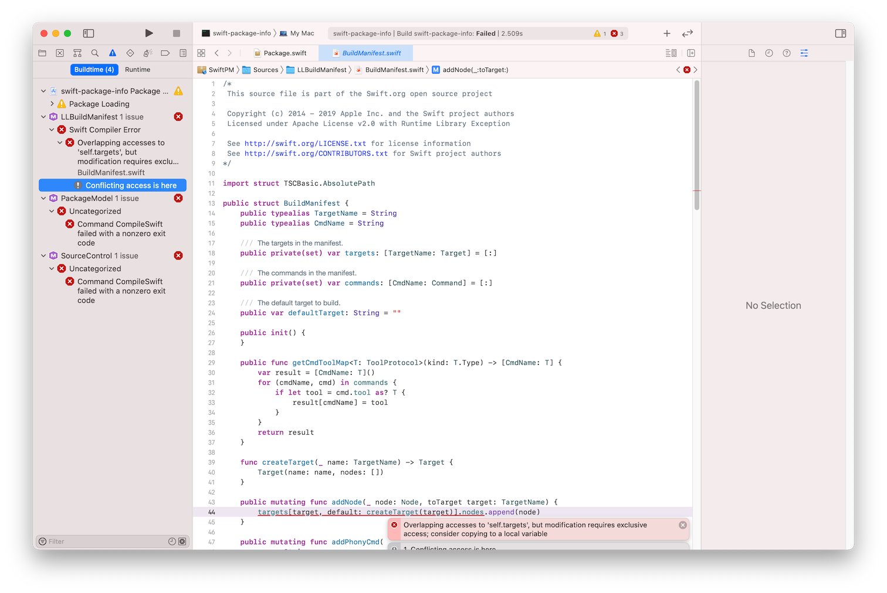

# swift-package-info
Sample package built on top of libSwiftPM (inspired by https://github.com/apple/swift-package-manager/tree/main/Examples/package-info)

## Why using a fork of apple/swift-package-manager ?

> Each tagged release of SwiftPM has to be used with a particular corresponding toolchain. The latest release is compatible with Swift 5.2. When Swift 5.3 was released, SwiftPM never had a version tagged

Source: https://forums.swift.org/t/using-swiftpm-as-package-dependency/45201

So the fork

```Swift
.package(name: "SwiftPM", url: "https://github.com/SDGGiesbrecht/swift-package-manager.git", .exact("0.50302.0")),
```

is used to avoid build error



which otherwise would occur when using

```Swift
.package(name: "SwiftPM", url: "https://github.com/apple/swift-package-manager.git", .exact("0.6.0"))
```

for 

```Swift
// swift-tools-version:5.3
// The swift-tools-version declares the minimum version of Swift required to build this package.

import PackageDescription

let package = Package(
    name: "swift-package-info",
    dependencies: [
        // Dependencies declare other packages that this package depends on.
        .package(name: "SwiftPM", url: "https://github.com/apple/swift-package-manager.git", .exact("0.6.0")),
    ],
    targets: [
        // Targets are the basic building blocks of a package. A target can define a module or a test suite.
        // Targets can depend on other targets in this package, and on products in packages this package depends on.
        .target(
            name: "swift-package-info",
            dependencies: ["SwiftPM"]),
        .testTarget(
            name: "swift-package-infoTests",
            dependencies: ["swift-package-info"]),
    ]
)
```
